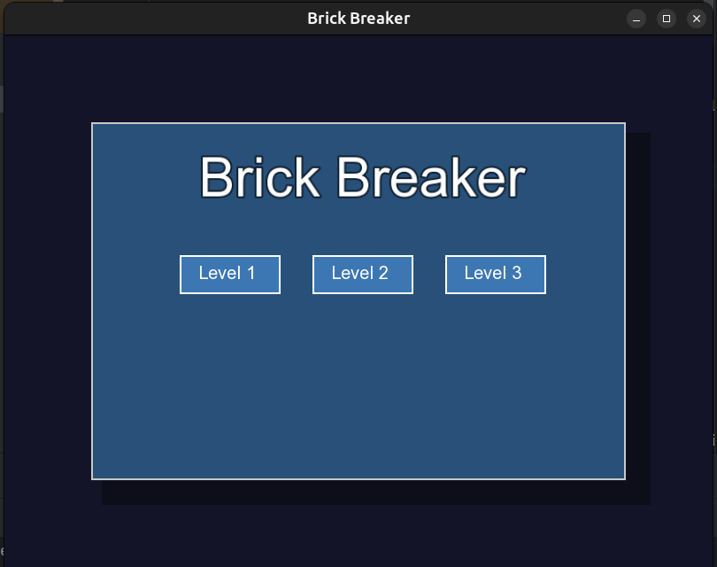

# Brick Breaker 🧱

<div align="center">
  
  <br>
  <strong>Version 1.0.0</strong>
  <br><br>
  <p>A modern reimagining of the classic arcade game, built with C++ and SFML</p>


</div>

## Table of Contents
- [Overview](#-Overview)
- [Screenshots](#-Screenshots)
- [Features](#-Features)
- [Installation](#-Installation)
- [How to Play](#-How-to-Play)
- [Controls](#-Controls)
- [Project Structure](#-Project-Structure)
- [Contributing](#-contributing)
- [Contact](#-contact)

## ✨ Overview

**Brick Breaker** combines nostalgic gameplay with modern enhancements. Built from scratch, it features:

- A robust game engine (`GameLogic`)
- Dynamic UI systems (`Interface`, `HUD`)
- Advanced screen management (`ScreenManager`)
- Powered by SFML for smooth graphics and immersive audio

Smash bricks, collect power-ups, and conquer three challenging levels with increasing difficulty, all while enjoying a sleek, responsive interface and customizable gameplay settings.

## 📸 Screenshots

<div align="center">
  
  
  
  
</div>

## 🎮 Features

### Gameplay
- **Progressive Challenge**: Three distinct levels with increasing difficulty (4-6 rows of bricks)
- **Dynamic Power-Ups**:
    - 🚀 **Speed Boost**: Temporarily increases ball velocity
    - 📏 **Paddle Extension**: Widens your paddle for easier returns

### Customization
- **Adjustable Settings**:
    - 🔊 Sound toggle (ON/OFF)
    - ⏱️ Game speed options (0.5x, 1.0x, 1.5x, 2.0x)
    - 🏆 High score management

### Interface
- **Intuitive Navigation**:
    - Welcoming main menu with level selection
    - In-game HUD displaying score, lives, level, and controls
    - Game Over screen with convenient reset/exit options

### Extras
- **Data Persistence**: High scores saved between sessions via `GameRecords`
- **Immersive Audio**: Effects for paddle hits, brick breaks, power-ups, and more

## 🚀 Installation

### Prerequisites
- **C++ Compiler**: GCC 9+ (C++11 required)
- **SFML**: Version 2.5.1 or higher ([Download](https://www.sfml-dev.org/download.php))
- **CMake**: Version 3.10+ (optional, for build automation)
- **OS Support**: Windows 10+, macOS 10.15+, or Linux (Ubuntu 20.04+ tested)

### Setup Guide

<details>
<summary><strong>1. Clone the Repository</strong></summary>

```sh
git clone https://github.com/vijay-kumar-mahto/brick-breaker.git
cd brick-breaker
```
</details>

<details>
<summary><strong>2. Install SFML</strong></summary>

#### Windows
- Download SFML from the official website
- Extract to `C:\SFML`
- Set environment variables

#### Linux
```sh
sudo apt-get install libsfml-dev
```

#### macOS
```sh
brew install sfml
```
</details>

<details>
<summary><strong>3. Build the Project</strong></summary>

```sh
mkdir build
cd build
cmake ..
cmake --build .
```
</details>

<details>
<summary><strong>4. Run the Game</strong></summary>

Navigate to `build/` and execute:
- Linux/macOS: `./BrickBreaker`
- Windows: `BrickBreaker.exe`
</details>

## 🎯 How to Play

1. **Launch**: Start the game by running the executable
2. **Navigate**:
    - **New Game**: Select Level 1, 2, or 3
    - **Resume**: Continue a paused session
    - **Settings**: Adjust sound/speed or reset high scores
3. **Gameplay**: Control the paddle to break bricks and collect power-ups
4. **Customize**: Toggle sound, adjust game speed, or reset high scores

## 🎛️ Controls

| Action | Key/Input |
|:-------|:----------|
| Move Paddle Left | ← Left Arrow |
| Move Paddle Right | → Right Arrow |
| Pause/Resume | Esc |
| Reset Game | R (during game over) |
| Return to Menu | Esc or Menu Button |
| Exit Game | Exit Button |
| Select Menu Option | Left Mouse Click |

## 📁 Project Structure

```
BrickBreaker/
├── include/                  # Header files
│   ├── Core/                # Core game components
│   │   ├── Ball.h           # Ball mechanics
│   │   ├── Brick.h          # Brick properties
│   │   ├── GameLogic.h      # Main game logic
│   │   ├── GameRecords.h    # High score management
│   │   ├── Paddle.h         # Paddle controls
│   │   └── PowerUp.h        # Power-up effects
│   ├── Screen/              # Screen management
│   │   ├── GameScreen.h     # Gameplay screen
│   │   ├── MenuScreen.h     # Menu screen
│   │   └── Screen.h         # Base screen class
│   └── UI/                  # UI components
│       ├── HUD.h            # Heads-up display
│       ├── Interface.h      # Menu interface
│       └── ScreenManager.h  # Screen transitions
├── src/                     # Source files
├── Resources/               # Assets
├── CMakeLists.txt          # CMake build configuration
├── LICENSE                 # MIT License file
└── README.md               # Markdown README (this file)
```

## 🤝 Contributing

Feel free to fork this repository and submit pull requests with improvements!

<details>
<summary><strong>Contribution Process</strong></summary>

1. **Fork**: Clone the repository to your GitHub account
2. **Branch**:
   ```sh
   git checkout -b feature/your-feature
   ```
3. **Develop**: Add features or fix bugs
4. **Test**: Verify functionality across all levels
5. **Commit**:
   ```sh
   git commit -m "Add your message"
   ```
6. **Push**:
   ```sh
   git push origin feature/your-feature
   ```
7. **PR**: Submit a pull request with a detailed description
</details>

<details>
<summary><strong>Contribution Guidelines</strong></summary>

- Use consistent C++ style (camelCase, comprehensive comments)
- Test with all speed settings and levels
- Update documentation for major changes
</details>

## 📞 Contact

For questions, suggestions, or issues:
- **Author**: Vijay Kumar Mahto
- **Email:** [vijaykumar961403@gmail.com](mailto:vijaykumar961403@gmail.com)
- **LinkedIn:** [Vijay Kumar Mahto](https://linkedin.com/in/vijay-kumar-mahto-872901298/)
- **GitHub**: [vijay-kumar-mahto](https://github.com/vijay-kumar-mahto)
- **Issues**: [Report a bug](https://github.com/vijay-kumar-mahto/brick-breaker/issues)

---

<div align="center">
  <i>Thank you for checking out Brick Breaker!</i>
</div>